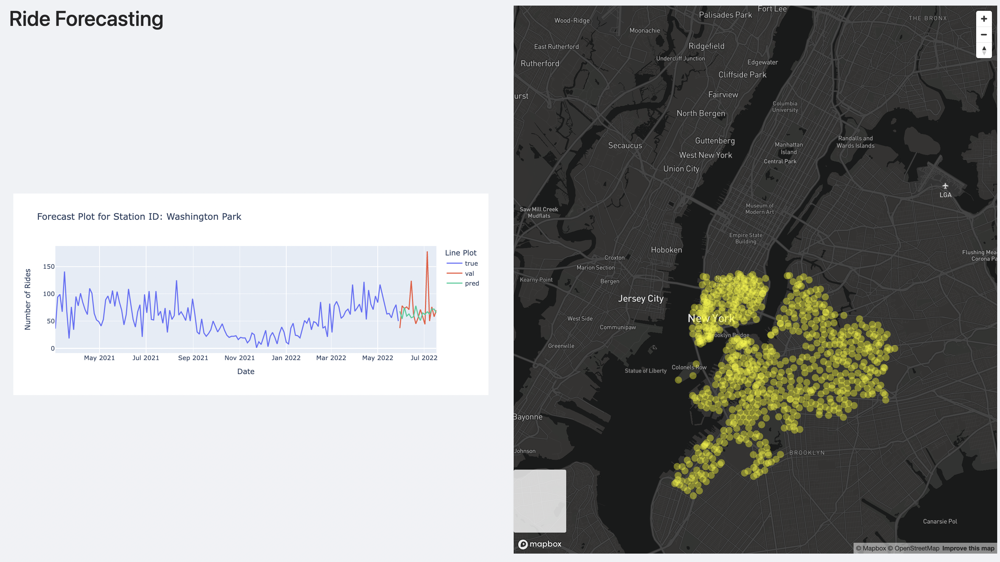

# City-Bike
Bike sharing systems have become an increasingly popular mode of transportation in urban areas worldwide, with a growing number of cities implementing them to promote sustainable mobility and reduce traffic congestion.
However, one of the most significant challenges facing bike sharing systems is ensuring bikes are available when and where they are needed most.
To address this challenge, the project proposes to analyze historical data and make predictions about future bike demand for each station. 

There are two parts to this project:

1. Forecasting
2. Visualisation

# Forecasting

We conducted experiments involving various forecasting models, including ARIMA, LSTM, and LSTM-CNN, to predict future City Bike Usage.

## How to run
1. Download the ***Cleaned_data.csv*** file from https://drive.google.com/drive/folders/1PfLOZI9myZ6moYbpP68MvIYH7BnOFEMQ
2. In the Notebooks folder, there is a ***ForecastingModels.ipynb*** file that includes implementations of forecasting models such as ARIMA, LSTM, and LSTM-CNN used to forecast city bike usage for a single bike station. Upload the downloaded ***Cleaned_data.csv*** file and the forecasting.ipynb file into ipython environment(Google Colab or Jupyter NoteBook) and run all cells.

# Visualisation

We employed the LSTM model and created visualizations for multiple bike stations. Please follow the steps outlined below to visualize the results.

## How to run
1. Run ***cd src*** (***src*** folder contains the visualisation code)
2. Download the ***assets*** folder from https://drive.google.com/drive/folders/1PfLOZI9myZ6moYbpP68MvIYH7BnOFEMQ. The generated plots for various bike stations are included in this folder, and they were created using the ***GeneratePlots.ipynb*** file.
3. Paste the downloaded assets folder into /src/
4. Install nvm
5. To install node version 16.17.0, run the command ***nvm install 16.17.0*** ( npm version 8.15.0 will be installed automatically )
6. Run the command ***nvm use 16.17.0***
7. Run the command ***npm install*** 
8. Run the command ***npm start*** (should run this command inside the src folder)
9. After the server is up and running, open the link http://localhost:4200/ride-forecasting to view the Ride forecasting module.
10. Click on the points on the interactive map to view plots for the forecasting plot of a particular bike station.

Link to the raw dataset: https://s3.amazonaws.com/tripdata/index.html

